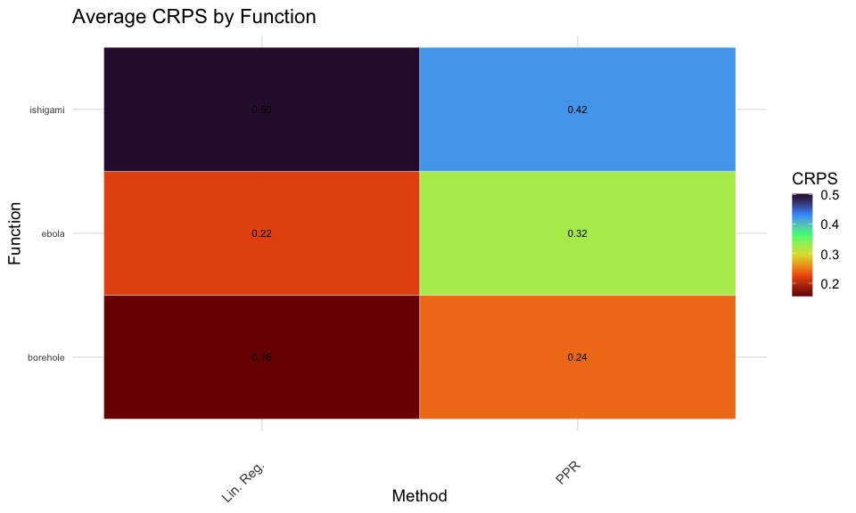

<!-- README.md is generated from README.Rmd. Please edit that file -->

# duqling: A Package for Reproducible UQ Research

[](https://www.gnu.org/licenses/gpl-3.0)
[](https://github.com/knrumsey/duqling)


### Description

The `duqling` R package contains a wide variety of test functions for
UQ. The goal of `duqling` is to facilitate reproducible UQ research by
providing a large number of test functions, datasets, and automated
simulation studies. The main functionality of `duqling` includes.

1.  A large library of test functions (see `quack()` function) with
    consistent usage and (optional) internal scaling which allows for
    inputs to be generated on the unit hyper-rectangle.
2.  A large library of UQ datasets (see `data_quack()` function) which
    are stored in the affiliated
    [UQDataverse](https://dataverse.harvard.edu/dataverse/UQdataverse/).
3.  Automated simulation studies for emulation (see `run_sim_study()`
    for test functions and `run_sim_study_data()` for datasets) which
    internally generates unique random seeds, allowing for direct
    comparison of results across papers and time.

## Installation

To install the `duqling` package, you will need the `remotes` package
(or the `devtools` package) which can be installed from CRAN by typing
`install.packages("remotes")`. Once you have the package, `duqling` can
be installed from github and loaded by typing

``` r
remotes::install_github("knrumsey/duqling")
library(duqling)
```

## Test Function Library

A master list of all functions found in the `duqling` package can be
found with the command

``` r
duqling::quack()
#>                      fname input_dim     response has_categorical stochastic
#> 1                 const_fn         1   univariate           FALSE      FALSE
#> 2               forrester1         1   univariate           FALSE      FALSE
#> 3  forrester1_low_fidelity         1   univariate           FALSE      FALSE
#> 4                   grlee1         1   univariate           FALSE      FALSE
#> 5                   banana         2   univariate           FALSE      FALSE
#> 6             borehole_cat         2   univariate            TRUE      FALSE
#> 7           borehole_cat80         2   univariate            TRUE      FALSE
#> 8             dms_additive         2   univariate           FALSE      FALSE
#> 9          dms_complicated         2   univariate           FALSE      FALSE
#> 10            dms_harmonic         2   univariate           FALSE      FALSE
#> 11              dms_radial         2   univariate           FALSE      FALSE
#> 12              dms_simple         2   univariate           FALSE      FALSE
#> 13              foursquare         2   univariate           FALSE      FALSE
#> 14                  grlee2         2   univariate           FALSE      FALSE
#> 15      lim_non_polynomial         2   univariate           FALSE      FALSE
#> 16          lim_polynomial         2   univariate           FALSE      FALSE
#> 17               moon3_cat         2   univariate            TRUE      FALSE
#> 18             multivalley         2   univariate           FALSE      FALSE
#> 19                 ripples         2   univariate           FALSE      FALSE
#> 20             simple_poly         2   univariate           FALSE      FALSE
#> 21                squiggle         2   univariate           FALSE      FALSE
#> 22                   star2         2   univariate           FALSE      FALSE
#> 23           twin_galaxies         2   univariate           FALSE      FALSE
#> 24               const_fn3         3   univariate           FALSE      FALSE
#> 25                   cube3         3   univariate           FALSE      FALSE
#> 26            cube3_rotate         3   univariate           FALSE      FALSE
#> 27            detpep_curve         3   univariate           FALSE      FALSE
#> 28               Gfunction         3   univariate           FALSE      FALSE
#> 29                ishigami         3   univariate           FALSE      FALSE
#> 30                 rabbits         3   univariate           FALSE      FALSE
#> 31                sharkfin         3   univariate           FALSE      FALSE
#> 32          simple_machine         3   functional           FALSE      FALSE
#> 33                   vinet         3   functional           FALSE      FALSE
#> 34              ocean_circ         4   univariate           FALSE       TRUE
#> 35                   park4         4   univariate           FALSE      FALSE
#> 36      park4_low_fidelity         4   univariate           FALSE      FALSE
#> 37               pollutant         4   functional           FALSE      FALSE
#> 38           pollutant_uni         4   univariate           FALSE      FALSE
#> 39         beam_deflection         5   functional           FALSE      FALSE
#> 40                   cube5         5   univariate           FALSE      FALSE
#> 41                friedman         5   univariate           FALSE      FALSE
#> 42            short_column         5   univariate           FALSE      FALSE
#> 43       simple_machine_cm         5   functional           FALSE      FALSE
#> 44       stochastic_piston         5   univariate           FALSE       TRUE
#> 45                 bs_call         6   functional           FALSE       TRUE
#> 46                  bs_put         6   functional           FALSE       TRUE
#> 47            cantilever_D         6   univariate           FALSE      FALSE
#> 48            cantilever_S         6   univariate           FALSE      FALSE
#> 49                 circuit         6   univariate           FALSE      FALSE
#> 50              Gfunction6         6   univariate           FALSE      FALSE
#> 51                  grlee6         6   univariate           FALSE      FALSE
#> 52                  crater         7   univariate           FALSE      FALSE
#> 53               gamma_mix         7   univariate           FALSE      FALSE
#> 54                  piston         7   univariate           FALSE      FALSE
#> 55                borehole         8   univariate           FALSE      FALSE
#> 56   borehole_low_fidelity         8   univariate           FALSE      FALSE
#> 57                 detpep8         8   univariate           FALSE      FALSE
#> 58                   ebola         8   univariate           FALSE      FALSE
#> 59                   robot         8   univariate           FALSE      FALSE
#> 60                dts_sirs         9   functional           FALSE       TRUE
#> 61            steel_column         9   univariate           FALSE      FALSE
#> 62                  sulfur         9   univariate           FALSE      FALSE
#> 63              friedman10        10   univariate           FALSE      FALSE
#> 64                ignition        10   univariate           FALSE      FALSE
#> 65              wingweight        10   univariate           FALSE      FALSE
#> 66             Gfunction12        12   univariate           FALSE      FALSE
#> 67              const_fn15        15   univariate           FALSE      FALSE
#> 68                    oo15        15   univariate           FALSE      FALSE
#> 69                  permdb        16   univariate           FALSE      FALSE
#> 70             Gfunction18        18   univariate           FALSE      FALSE
#> 71              friedman20        20   univariate           FALSE      FALSE
#> 72                 welch20        20   univariate           FALSE      FALSE
#> 73            d_onehundred       100 multivariate           FALSE      FALSE
#> 74              onehundred       100   univariate           FALSE      FALSE
```

A list of all functions meeting certain criterion can be found with the
command

``` r
duqling::quack(input_dim=4:7, stochastic="n")
#>                 fname input_dim   response has_categorical stochastic
#> 1               park4         4 univariate           FALSE      FALSE
#> 2  park4_low_fidelity         4 univariate           FALSE      FALSE
#> 3           pollutant         4 functional           FALSE      FALSE
#> 4       pollutant_uni         4 univariate           FALSE      FALSE
#> 5     beam_deflection         5 functional           FALSE      FALSE
#> 6               cube5         5 univariate           FALSE      FALSE
#> 7            friedman         5 univariate           FALSE      FALSE
#> 8        short_column         5 univariate           FALSE      FALSE
#> 9   simple_machine_cm         5 functional           FALSE      FALSE
#> 10       cantilever_D         6 univariate           FALSE      FALSE
#> 11       cantilever_S         6 univariate           FALSE      FALSE
#> 12            circuit         6 univariate           FALSE      FALSE
#> 13         Gfunction6         6 univariate           FALSE      FALSE
#> 14             grlee6         6 univariate           FALSE      FALSE
#> 15             crater         7 univariate           FALSE      FALSE
#> 16          gamma_mix         7 univariate           FALSE      FALSE
#> 17             piston         7 univariate           FALSE      FALSE
```

A detailed description of each function (the `borehole()` function, for
example) can be found with the command

``` r
duqling::quack("borehole")
#> Function: borehole 
#>   Input dimension: 8 
#>   Response type: univariate 
#>   Stochastic: No 
#>   Has categorical inputs: FALSE 
#> 
#> Input ranges:
#>        [,1]      [,2]
#> rw     0.05      0.15
#> r    100.00  50000.00
#> Tu 63070.00 115600.00
#> Hu   990.00   1110.00
#> Tl    63.10    116.00
#> Hl   700.00    820.00
#> L   1120.00   1680.00
#> Kw  9855.00  12045.00
```

#### Calling Test Functions

Every function in the `duqling` package will (optionally) perform
internal scaling so that inputs can be passed on a $(0, 1)$ scale for
simplicity. This internal scaling is performed when `scale01=TRUE`,
which is the default for all functions in the package. See help files
for each individual function for details, e.g. `?borehole`.

``` r
n <- 100
p <- 8
X <- matrix(runif(n*p), nrow=n, ncol=p)

# This is how duqling functions are generally called
y <- apply(X, 1, borehole)

# This is equivalent but safer 
y <- apply(X, 1, duqling::borehole)

# Or you can use the wrapper
y <- eval_duq(borehole, X)
y <- eval_duq("borehole", X)
```

When setting `scale01=FALSE`, the inputs are expected to be on the
“native scale”. For example, the Ishigami function usually expects
inputs $x_1, x_2, x_3 \in [-\pi, \pi]$.

``` r
n <- 100

# On native scale
pi <- base::pi
X_native <- cbind(runif(n, -pi, pi),
                  runif(n, -pi, pi),
                  runif(n, -pi, pi))
y_native <- apply(X_native, 1, ishigami, scale01=FALSE)

# On zero-one scale
X_01 <- (X_native + pi) / (2 * pi) # These inputs are between 0 and 1
y_01 <- apply(X_01, 1, ishigami, scale01=TRUE)

# Same result
all(y_native == y_01)
#> [1] TRUE
```

Note that you can get the native bounds for any function using `quack`,
e.g., `quack("ishigami", verbose=FALSE)$input_range`.

## A Repository for UQ Datasets

The package also works as an interface for some uncertainty
quantification datasets which are hosted in the UQDataverse, at . Get
info on the datasets with the command.

``` r
data_quack(raw=TRUE)
#>             dname input_dim output_dim       n input_cat_dim
#> 1   Z_machine_exp         1          1   23224             3
#> 2            e3sm         2          1   48602             1
#> 3  stochastic_sir         4          1    2000             0
#> 4         pbx9501         6         10    7000             1
#> 5  flyer_plate104        11        200    1000             0
#> 6 strontium_plume        20         10     300             0
#> 7   Z_machine_sim        40          9 5000000             0
#> 8    fair_climate        46          1  168168             1
```

Many emulation datasets have been prepped and can be viewed and accessed
as follows.

``` r
data_quack(raw=FALSE, response_type="uni")
#>                             dname input_dim input_cat_dim     n response_type
#> 1                            e3sm         2             0 48602           uni
#> 2                       e3sm_mcar         2             0 10000           uni
#> 3                       e3sm_mnar         2             0  9122           uni
#> 4                  stochastic_sir         4             0  2000           uni
#> 5                       SLOSH_low         5             0  4000           uni
#> 6                       SLOSH_mid         5             0  4000           uni
#> 7                      SLOSH_high         5             0  4000           uni
#> 8                    pbx9501_gold         6             0   500           uni
#> 9                   pbx9501_ss304         6             0   500           uni
#> 10                 pbx9501_nickel         6             0   500           uni
#> 11                pbx9501_uranium         6             0   500           uni
#> 12             Z_machine_max_vel1         6             0  5000           uni
#> 13             Z_machine_max_vel2         6             0  5000           uni
#> 14                 flyer_plate104        11             0  1000           uni
#> 15            strontium_plume_p4b        20             0   300           uni
#> 16           strontium_plume_p104        20             0   300           uni
#> 17          Z_machine_max_vel_all        30             0  5000           uni
#> 18 fair_climate_ssp1-2.6_year2200        45             0  1001           uni
#> 19 fair_climate_ssp2-4.5_year2200        45             0  1001           uni
#> 20 fair_climate_ssp3-7.0_year2200        45             0  1001           uni
#> 21          fair_climate_ssp1-2.6        46             0 56056           uni
#> 22          fair_climate_ssp2-4.5        46             0 56056           uni
#> 23          fair_climate_ssp3-7.0        46             0 56056           uni
```

``` r
# Chunk not evaluated
dname <- "e3sm_mcar"
dat <- get_emulation_data(dname)
X <- dat$X
y <- dat$y
```

## Reproducible Simulation Studies

Define fit and prediction functions and pass them to `run_sim_study()`
or `run_sim_study_data()`. See `?run_sim_study()` for details. There are
a few ways to set these functions up, but the standard approach is

- `fit_func` takes two arguments `X` and `y` and returns an object that
  will get passed to `pred_func`.
- `pred_func` takes two arguments `obj` (from `fit_func`) and `Xt` (a
  test set) and returns an $M\times n_\text{test}$ matrix of predictions
  (M can be any number, but we recommend $M\approx 1000$.).

``` r
# Method 1: Linear regression
fit_lm <- function(X, y){
  X <- as.data.frame(X)
  X$y <- y
  fit <- lm(y~., data=X)
}

pred_lm <- function(obj, Xt){
  M <- 1000 # Number of predictive samples
  Xt <- as.data.frame(Xt)
  
  # Make predictions
  pred <- predict(obj, newdata=Xt, se.fit = TRUE)
  mu <- pred$fit
  se <- pred$se.fit
  
  sigma2 <- summary(obj)$sigma^2
  
  # predictive variance = model uncertainty + noise
  sd_pred <- sqrt(se^2 + sigma2)
  
  n <- length(mu)
  
  # Generate M samples per test point
  samples <- matrix(
    rnorm(n * M, mean = rep(mu, each = M), sd = rep(sd_pred, each = M)),
    nrow = M,
    ncol = n
  )
}
```

Now you choose simulation settings and run the simulation study:

- **`fnames`**: A vector of test function names to evaluate. These
  should come from `quack()`. A convenient default is
  `get_paper_funcs()`, which returns the 60 test functions used in the
  main study (see reference).

- **`n_train`**: A vector of training sample sizes. Larger values
  correspond to more data available for fitting the emulator.

- **`NSR`**: Noise-to-signal ratio. Controls the level of noise added to
  the simulator output. Smaller values correspond to cleaner (less
  noisy) observations.

- **`design_type`**: The experimental design used to generate training
  inputs. Common options include `"LHS"` (maximin Latin hypercube for
  moderate sizes), `"grid"`, and `"uniform"` (random sampling).

- **`replications`**: The number of replications to run.

``` r
fnames <- c("borehole", "ishigami", "ebola")
n_train <- 100
NSR <- c(0, 0.1, 0.25)
design_type <- "LHS"

# Run simulation study
res_lm <- run_sim_study(fit_lm, pred_lm,
                        fnames=fnames,
                        n_train=n_train,
                        NSR=NSR,
                        design_type=design_type,
                        method_names="Lin. Reg.",
                        replications=3,
                        mc_cores=1, # For parallel computation
                        n_test=100,  # Make it go faster
                        verbose=FALSE)
```

We can compare to another method, say projection pursuit regression (see
`?ppr`), easily.

``` r
fit_ppr <- function(X, y) {
  X <- as.matrix(X)
  stats::ppr(x = X, y = y, nterms=10)
}

pred_ppr <- function(obj, Xt) {
  M <- 1000
  Xt <- as.matrix(Xt)

  # Point predictions
  mu <- as.numeric(stats::predict(obj, Xt))

  # Residual sd from training fit
  sigma <- sqrt(mean(obj$residuals^2))
  n_test <- length(mu)

  # Return M x n_test predictive samples
  preds <- vapply(
    seq_len(n_test),
    function(i) stats::rnorm(M, mean = mu[i], sd = sigma),
    numeric(M)
  )

  preds
}

res_ppr <- run_sim_study(fit_ppr, pred_ppr,
                        fnames=fnames,
                        n_train=n_train,
                        NSR=NSR,
                        design_type=design_type,
                        method_names="PPR",
                        replications=3,
                        mc_cores=1, # For parallel computation
                        n_test=100,  # Make it go faster
                        verbose=FALSE)
```

Now we can use `duqling` to do various comparisons, analysis, and
visualization. s

``` r
# Process the studies in duqling
duq_lm  <- process_sim_study(res_lm)
duq_ppr <- process_sim_study(res_ppr)

# Join them together
duq <- join_sim_study(duq_lm, duq_ppr)

# Analyze
summarize_sim_study(duq, 
                    summarize=c("time", "CRPS", "RMSE"),
                    win_rate=NULL,
                    soft_rel=NULL,
                    group_by = "id", split_tables=FALSE)
#>      method   time_mean CRPS_mean  RMSE_mean       id
#> 1 Lin. Reg. 0.004888889 0.1561515 11.5985642 borehole
#> 2       PPR 0.007333333 0.2408591 14.9772711 borehole
#> 3 Lin. Reg. 0.004000000 0.2197608  0.1918249    ebola
#> 4       PPR 0.006666667 0.3239365  0.2151097    ebola
#> 5 Lin. Reg. 0.004666667 0.5020445  3.2933865 ishigami
#> 6       PPR 0.005333333 0.4228206  2.4266673 ishigami

# Make visuals
heatmap_sim_study(duq, metric="CRPS")
```



Similar studies can be run for real data sets using
`run_sim_study_data()`.

## Large Scale Reproducible Benchmark Example

The `duqling` package also includes results from a large-scale benchmark
study of computer model emulators. These data were used in the paper

Rumsey, K.N., Gibson, G.C., Francom, D. and Morris, R. *All Emulators
are Wrong, Many are Useful, and Some are More Useful Than Others: A
Reproducible Comparison of Computer Model Surrogates.* \[add link here\]

These benchmark results can be loaded directly from the package and
processed using the same workflow as any other `duqling` simulation
study.

``` r
data("sim_study_testfuncs")
duq_tf <- process_sim_study(sim_study_testfuncs)

data("sim_study_realdata")
duq_tf <- process_sim_study(sim_study_realdata)
```

The plotting and analysis functions provided by the package include

- `summarize_sim_study()`: Computes summary statistics across simulation
  scenarios (e.g., mean or median performance), producing a compact view
  of emulator performance.

- `heatmap_sim_study()`: Visualizes performance metrics (e.g., CRPS,
  FVU) across scenarios using heatmaps, helping identify patterns across
  settings.

- `rankplot_sim_study()`: Displays cumulative rank distributions,
  showing how often each emulator achieves a given rank or better.

- `paretoplot_sim_study()`: Plots trade-offs between metrics (typically
  accuracy vs. compute time), highlighting Pareto-efficient methods.

- `perfprofile_sim_study()`: Generates performance profile plots,
  showing the proportion of scenarios for which each method is within a
  factor of the best.

- `boxplots_sim_study()`: Produces boxplots of performance metrics
  across scenarios, useful for assessing variability and the Rashomon
  effect.

- `rank_sim_study()`: Computes rank-based summaries for a specified
  metric and appends corresponding rank columns.

- `normalize_sim_study()`: Normalizes metrics (e.g., scaling relative to
  variance or baseline values) to improve comparability across
  scenarios.

- `relativize_sim_study()`: Computes relative performance metrics by
  comparing each method to the best-performing method within each
  scenario.

- `collapse_sim_study()`: Aggregates results across replications or
  folds, producing a reduced data frame suitable for summary analyses.

### Release Information

LA-UR-25-27410

### Copyright Notice

*2023. Triad National Security, LLC. All rights reserved.*

*This program was produced under U.S. Government contract
89233218CNA000001 for Los Alamos National Laboratory (LANL), which is
operated by Triad National Security, LLC for the U.S. Department of
Energy/National Nuclear Security Administration. All rights in the
program are. reserved by Triad National Security, LLC, and the U.S.
Department of Energy/National Nuclear Security Administration. The
Government is granted for itself and others acting on its behalf a
nonexclusive, paid-up, irrevocable worldwide license in this material to
reproduce, prepare. derivative works, distribute copies to the public,
perform publicly and display publicly, and to permit others to do so.*
